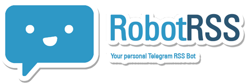

# RobotRSS - A Telegram RSS Bot



## Description

RobotRSS is an RSS Bot for the Telegram Messenger. Subscribe to different news channels and stay up-to-date. Receive instant messages in your Messenger app when websites are updated, e. g. on news pages, blogs or audio/video logs.

### Usage

RobotRSS has an easy-to-use user interface to get started. Write the **official [@RobotRssBot][2f7e3ad7]** via telegram. Use the following commands to manage your subscriptions:

[2f7e3ad7]: https://telegram.me/RobotRssBot "RobotRSS"

**Controls**  
`/start` - Activates the bot. If you have subscribed to RSS feeds, you will receive news from now on  
`/stop` - Deactivates the bot. You won't receive any messages from the bot until you activate the bot again using the start comand

**RSS Management**  
`/add <url> <entryname>` - Adds a new subscription to your list.  
`/remove <entryname>` - Removes an exisiting subscription from your list.  
`/list` - Shows all your subscriptions as a list.

**Other**  
`/about` - Shows some information about RobotRSS Bot  

## Feature Request and Contributing

You have suggestions for improvements or features you miss? You are welcome to express all your wishes here. Just create a new [Issue][e872f832] and it will be taken care of quickly!

[e872f832]: https://github.com/cbrgm/telegram-robot-rss/issues "RobotRSS Issues"

If you are a developer yourself, you can also contribute code! Further information will follow shortly.

## Installation

The source code of RobotRSS is Open Source and openly accessible and editable. If you would like to use your own bot as newsfeed reader, you will find everything you need to install it here. It is recommended to run the bot in a docker container. You can find the latest, stable Docker Image on Dockerhub. If you make changes to the source code, you can easily create a new image of your version using the dockerfile located in the project folder.

### Create a credentials file

First, you must tell RobotRSS which bot the service is allowed to communicate with. Create a new telegram bot or use an existing one. All you need is the Bot's `Token` from Telegram. You can receive one from Telegrams [Botfather][db6676cf].

Edit the `sample-credentials.json` file located at `/resources/sample-credentials.json`.

```json
{
  "telegram_token": "INSERT TOKEN",
  "update_interval": 300
}
```

Insert your token and safe the file as **`credentials.json`** at `/resources/credentials.json`!

  [db6676cf]: tg://resolve?domain=BotFather "Botfather"

### Install Dependencies using pip

You can easily install all needed Dependencies using `pip`. Navigate into the project directory and run `pip install -r requirements.txt`. If you prefer installing all Dependencies manually you can find a detailed list of all needed packages at the "Dependencies" Section at the bottom of the page.

### Create a Docker Image

You can easily run RobotRSS inside a Docker Container. The Dockerfile can be found in the project directory. Run `docker build --tag "RobotRSS:latest" .` to create a new Docker Image based on the current code.

You can also pull the latest image from Dockerhub using `docker pull cynthek/RobotRSS:latest`.

## Python Version

RobotRSS has been successfully tested with Python 2.7

## Dependencies

All Dependencies can be found in the `requirements.txt` file in the project directory.

## Motivation

This script was originally developed by [Christian Bargmann][b9824663] for practice purposes with Python.

  [b9824663]: http://cbrgm.de "blog"
